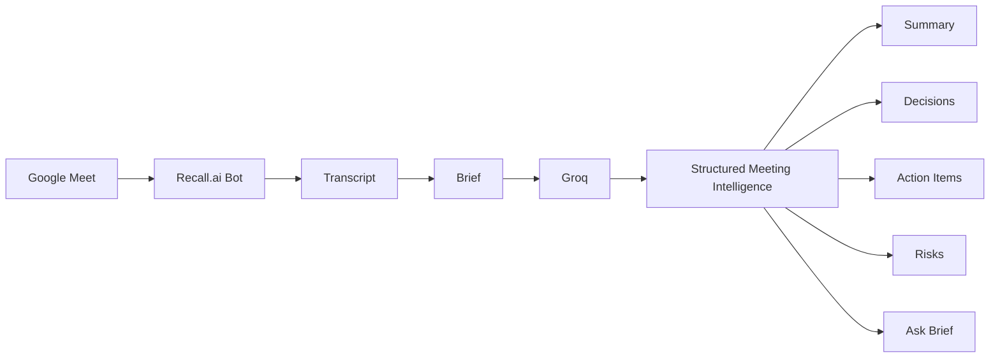

# Brief

AI meeting intelligence that turns real conversations into decisions, action items, risks, and searchable knowledge.

**Live demo:** [https://fathom-ai-clone-blond.vercel.app](https://fathom-ai-clone-blond.vercel.app)

## Demo

🎥 Watch the 3-minute product walkthrough: [Loom video](LOOM_URL_HERE)

*(Replace `LOOM_URL_HERE` with your Loom link after recording.)*

## What is Brief?

Brief is a production-shaped AI meeting intelligence application. Users send **Brief Notetaker** into a meeting through Recall.ai, or import an existing transcript by paste or `.txt` upload.

Brief converts the conversation into structured intelligence using Groq-powered LLM workflows: summaries, decisions, action items, risks, evidence links, and grounded meeting Q&A.

The product focus is reliable post-meeting intelligence — not a chat toy and not an unfinished capture theater.

## Live Demo

| | |
|---|---|
| **Production** | [https://fathom-ai-clone-blond.vercel.app](https://fathom-ai-clone-blond.vercel.app) |
| **Demo video** | [Add Loom URL](LOOM_URL_HERE) |

Sign in with Google to capture meetings, or open **View Demo** / Analyze to try the Q4 example without an account.

## Core Features

### Meeting Bot

Launch Brief Notetaker into a supported meeting (e.g. Google Meet) using Recall.ai. Brief receives the meeting transcript after processing and runs the intelligence pipeline.

### AI Meeting Intelligence

Generate concise summaries and meeting purpose from the conversation.

### Decisions & Outcomes

Extract important decisions and typed meeting outcomes (decisions, commitments, risks, decision changes, open questions).

### Action Items

Identify follow-up work and ownership when supported by the transcript.

### Risks & Open Questions

Surface unresolved issues that still need attention.

### Evidence-Linked Insights

Connect important outcomes back to transcript evidence you can jump to and verify.

### Ask Brief

Ask grounded questions about the captured or imported meeting and get answers tied to evidence.

### Transcript Import

Paste transcripts or upload `.txt` files. Includes a Q4 demo example.

### Google Authentication

Google OAuth via Auth.js (NextAuth v5).

### Meeting Dashboard

Review captured and imported meetings in an authenticated library, with public share routes for seeded demo meetings.

## Architecture



Manual ingestion path:

`.txt` / pasted transcript → Brief → Groq → same structured meeting UI

Server-side Recall webhooks and on-demand bot sync feed the capture path. Generated and captured meetings that you open in the browser are stored in **`brief.generatedMeetings.v1` localStorage** for the portfolio demo (see Limitations).

## Tech Stack

| Area | Technology |
|------|------------|
| Frontend | Next.js 16, React 19, TypeScript, Tailwind CSS |
| Authentication | Auth.js / NextAuth v5, Google OAuth |
| Meeting infrastructure | Recall.ai Meeting Bots |
| AI | Groq (`GROQ_MODEL`, default `openai/gpt-oss-120b`) |
| Deployment | Vercel |

## How It Works

### Capture

1. Sign in with Google.
2. Open **Capture Meeting**.
3. Paste a supported meeting URL.
4. Send Brief Notetaker.
5. Admit the notetaker if the meeting requires it.
6. Conduct the meeting normally.
7. Brief receives the transcript after processing.
8. AI extracts structured meeting intelligence.
9. Review the meeting and ask questions.

### Transcript import

1. Open **Analyze Transcript** (or View Demo).
2. Paste a transcript or upload a `.txt` file (or load the Q4 example).
3. Brief runs the same Groq intelligence pipeline.
4. Open the meeting detail view for summary, outcomes, transcript, and Ask Brief.

## Verified Integration

The Recall.ai meeting-bot workflow was tested end-to-end with a real Google Meet: bot join, meeting capture, multi-speaker transcript, AI analysis, and grounded meeting Q&A.

## Environment Variables

Names only — never commit real values. See `.env.example`.

| Variable | Purpose |
|----------|---------|
| `GROQ_API_KEY` | Groq API key (server-side only) |
| `GROQ_MODEL` | Optional model override |
| `AUTH_SECRET` | Auth.js secret |
| `AUTH_GOOGLE_ID` | Google OAuth client ID |
| `AUTH_GOOGLE_SECRET` | Google OAuth client secret |
| `AUTH_URL` | Optional; set on Vercel if host detection fails |
| `RECALL_REGION` | Recall region (e.g. `us-east-1`) |
| `RECALL_API_KEY` | Recall API token (server-side only) |
| `RECALL_WEBHOOK_VERIFICATION_SECRET` | Webhook signature secret |
| `RECALL_BOT_NAME` | Display name for the meeting bot |
| `PUBLIC_API_BASE_URL` | Public HTTPS origin for webhooks |
| `RECALL_CALENDAR_REGIONAL_CALLBACK_URI` | Optional Calendar V2 callback (not required for Capture) |

## Local Development

```bash
git clone https://github.com/Muhammad-Daniyal-1/fathom_ai_clone.git
cd fathom_ai_clone
npm install
cp .env.example .env.local
# fill in values in .env.local
npm run dev
```

Open [http://localhost:3000](http://localhost:3000).

Useful checks:

```bash
npm run test:recall
npm run build
```

## Security

- Recall and Groq credentials stay server-side (never `NEXT_PUBLIC_`).
- Recall webhooks verify Svix-compatible signatures.
- Recall bot/meeting list and detail APIs require an authenticated session and are scoped by user email.
- Google OAuth via Auth.js.
- Secrets are excluded from source control (`.env*` / local data dirs gitignored).

This is not a formal security audit — it describes what the app implements today.

## Current Limitations

- Captured and AI-generated meetings persist in **browser localStorage** for this portfolio build (not a shared database).
- Calendar scheduling is not presented as a completed product surface.
- Audio playback is available for seeded demo meetings with audio; **Recall-captured meetings are transcript-first** (no captured-audio player exposed).
- Meeting join/provider behavior depends on Recall.ai.
- Transcript quality depends on upstream transcription.

## Future Improvements

- Durable database-backed meeting persistence
- Google Calendar scheduling as a first-class product flow
- Richer team / workspace support
- Additional meeting providers
- Production observability

## Why This Project

Brief was built to explore production AI engineering beyond a chat interface: external meeting infrastructure, asynchronous webhooks, transcript normalization, structured LLM outputs, evidence grounding, authentication, and a complete full-stack product workflow.

## Screenshots

Add three screenshots under `docs/screenshots/` (or update the links below):

1. **Landing** — hero + CTAs  
2. **Dashboard** — Capture Meeting + meeting library  
3. **Meeting intelligence** — summary / outcomes / Ask Brief  

```markdown


```

## License

Private portfolio project unless otherwise noted.
